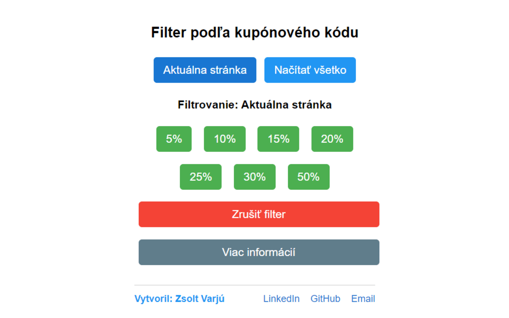
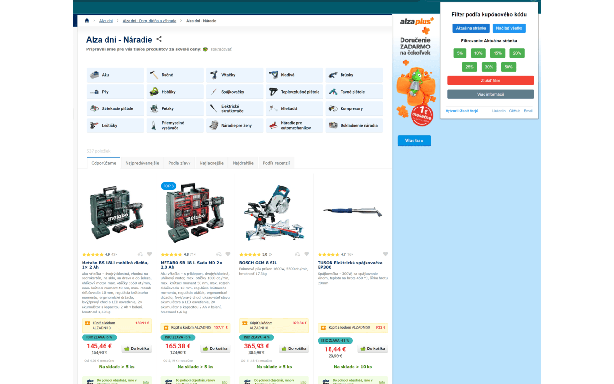
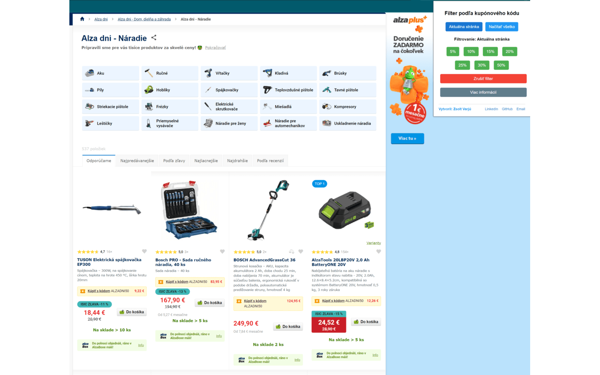

# Alza Dni Kupónový Filter

# Inštalácia rozšírenia Alza Dni Kupónový Filter do prehliadača Firefox

Postupujte podľa nasledujúcich krokov na inštaláciu rozšírenia z GitHubu do vášho prehliadača Firefox:

1. **Stiahnite súbory rozšírenia**
   - Navštívte GitHub repozitár rozšírenia.
   - Kliknite na zelené tlačidlo „Code“ a vyberte možnosť „Download ZIP“.
   - Po stiahnutí extrahujte ZIP súbor do priečinka na vašom počítači.

2. **Otvorte Firefox**
   - Spustite svoj prehliadač Firefox.

3. **Prejdite na stránku s doplnkami**
   - Do adresného riadku zadajte `about:debugging#/runtime/this-firefox` a stlačte Enter.

4. **Dočasne načítajte rozšírenie**
   - Na stránke s doplnkami kliknite na „Načítať dočasné doplnky“.
   - Prejdite do priečinka, kde ste extrahovali súbory rozšírenia.
   - Vyberte súbor `manifest.json` a kliknite na „Otvorit“.

5. **Potvrďte inštaláciu**
   - Rozšírenie by sa malo teraz zobraziť v zozname dočasných doplnkov.
   - Mali by ste vidieť ikonu rozšírenia na paneli nástrojov prehliadača.

6. **Použite rozšírenie**
   - Prejdite na stránku Alza.cz alebo Alza.sk.
   - Kliknite na ikonu rozšírenia na otvorenie vyskakovacieho okna a využite funkcie filtra.

**Vezmite na vedomie:**
- Táto metóda načítava rozšírenie dočasne. Bude odstránené, keď zatvoríte Firefox.

### Bez filtra

### S aplikovaným filtrom

## Prispievanie

Príspevky sú vítané! Ak máte nápady na zlepšenie alebo ste našli chybu, neváhajte otvoriť issue alebo poslať pull request.

## Autor

Vytvoril [Zsolt Varjú](https://github.com/zsoolti8917)
         [LinkedIn](https://www.linkedin.com/in/zsoltvarju/)
